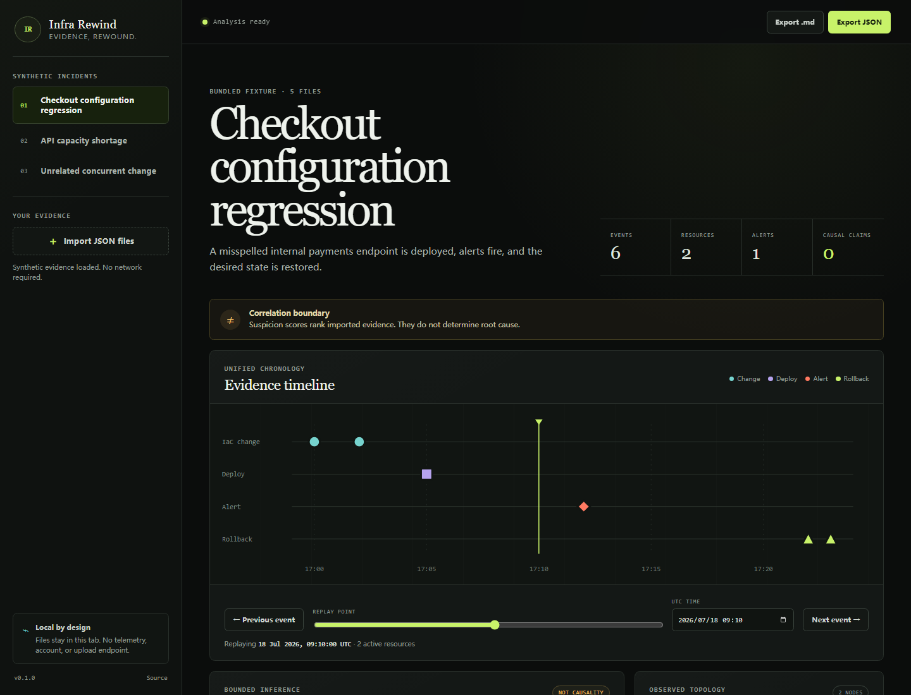
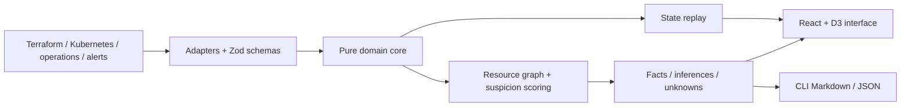

# Infra Rewind

[](https://github.com/KanadeK/infra-rewind/actions/workflows/ci.yml)
[](https://github.com/KanadeK/infra-rewind/actions/workflows/security.yml)
[](https://github.com/KanadeK/infra-rewind/actions/workflows/pages.yml)
[](https://github.com/KanadeK/infra-rewind/releases/latest)
[](LICENSE)

[简体中文](README.zh-CN.md) · **Status: v0.1.0**

Infra Rewind turns Terraform plans, Kubernetes diffs, deployments, alerts, and rollbacks into one
reviewable incident timeline. It reconstructs resource state at any imported timestamp and ranks
correlated changes without presenting correlation as certain root cause.



- **Rewind desired state:** inspect what each imported resource looked like before, during, or
  after an incident.
- **Keep reasoning auditable:** every score exposes time, resource-relation, and mutation-risk
  dimensions with source pointers.
- **Stay local by default:** the web app needs no account, telemetry, upload endpoint, or network
  access after its static assets load.

Fastest local start:

```bash
npm ci
npm run dev
```

Open the printed local URL and use a bundled incident immediately. A real CLI input/output path is:

```bash
npm run analyze -- examples/config-misconfiguration --format markdown
```

The committed input records a Kubernetes endpoint change from `payments.internal` to
`payment.internal`, a deployment, a 5xx alert, and a rollback. The generated report ranks that diff
at **96/100 as an inference**, links it to `kubernetes-diff.json/changes/0`, and still lists certain
root cause plus missing telemetry under **Unknowns**.

> Privacy boundary: redaction is defense in depth, not a confidentiality guarantee. Resource names,
> topology, IDs, and free-form text can still be sensitive. Review every export before sharing.

## Features

- Zod-validated import of Terraform plan JSON, Infra Rewind Kubernetes diffs, operation events, and
  alert events.
- Deterministic normalization, stable resource IDs, changed-field extraction, and sensitive-value
  redaction.
- A resource relationship graph and bounded suspicion score derived from temporal proximity,
  observed resource affinity, and mutation risk.
- Arbitrary-time resource-state replay with create, update, replacement, deletion, and rollback
  semantics.
- Reports that explicitly separate observed facts, explainable inferences, and unresolved unknowns.
- Responsive React interface with a D3 UTC timeline, keyboard controls, local multi-file import,
  Web Worker analysis, and real Markdown/JSON downloads.
- Offline CLI, local adapters, deterministic examples, and an optional guarded HTTP adapter.

## Non-goals

Infra Rewind is not an APM, log store, deployment controller, incident manager, or autonomous
root-cause system. It does not collect production data, contact cloud APIs, mutate infrastructure,
or prove causality. v0.1.0 does not parse every vendor's proprietary export.

## Architecture



`src/core/` has no UI or network dependency. Browser analysis runs in a module Worker; adapters only
translate external representations into core events. See [Architecture](docs/ARCHITECTURE.md) and
[input formats](docs/INPUT_FORMATS.md).

## Installation

Requirements:

- Node.js 22.13 or newer
- npm 10 or newer
- Chromium installed by Playwright only when running browser tests or recapturing the screenshot

```bash
git clone https://github.com/KanadeK/infra-rewind.git
cd infra-rewind
npm ci
npm run dev
```

The hosted synthetic demo is available at
[kanadek.github.io/infra-rewind](https://kanadek.github.io/infra-rewind/). It contains no user data
or credentials.

## Quick start

Generate real, human-readable reports from all three committed incidents:

```bash
npm run demo
```

Open `demo-output/README.md`, or analyze one incident at a specific time:

```bash
npm run analyze -- examples/config-misconfiguration \
  --format markdown \
  --at 2026-07-18T09:24:00.000Z \
  --out demo-output/config-after-rollback.md
```

The replayed `k8s:payments/deployment/api` state contains
`PAYMENTS_BASE_URL=https://payments.internal`, matching the recovery fixture.

## Complete example

The example manifest names evidence files, a default replay point, a bounded top-candidate
expectation, and exact state assertions:

```json
{
  "schema": "infra-rewind/scenario@1",
  "id": "unrelated-concurrent-change",
  "evidenceFiles": [
    "terraform-plan.json",
    "kubernetes-diff.json",
    "operations.json",
    "alerts.json"
  ],
  "defaultReplayAt": "2026-07-20T15:15:00.000Z",
  "expected": {
    "topCandidateId": null,
    "maxCandidateScore": 25,
    "replayChecks": [
      {
        "at": "2026-07-20T15:15:00.000Z",
        "resourceId": "k8s:storefront/deployment/web",
        "path": "spec.template.metadata.annotations.banner",
        "equals": "summer"
      }
    ]
  }
}
```

Running `npm run demo` currently produces three low-confidence inferences for this incident and a
top score of 18/100. The report calls all of them inferences and preserves the causal question as
unknown; it does not convert concurrency into a root-cause claim.

## CLI, source API, and interface

### CLI

```text
npm run analyze -- <scenario-directory> [options]

--format <json|markdown>  Export format (default: markdown)
--out <path>              Write to a file instead of stdout
--at <ISO timestamp>      Include reconstructed resource state at that time
```

Failures return a non-zero exit code with a source-specific validation or filesystem error.

### Source API

The v0.1.0 package is an application, not a published npm library. Repository consumers can import
the pure functions directly:

```ts
import { analyzeEvents, parseEvidenceDocument, replayStateAt } from "./src/core";

const events = parseEvidenceDocument(jsonText, { sourceName: "alerts.json" });
const analysis = analyzeEvents(events);
const state = replayStateAt(analysis.events, "2026-07-18T09:10:00.000Z");
```

Adapters under `src/adapters/` load browser `File` objects, a safe local scenario directory, or an
explicit `http:`/`https:` URL. All routes pass through the same validators and redaction layer.

### Web interface

Choose a synthetic incident or import multiple supported JSON files. Timeline markers and previous
or next controls update the replay point; the resource panel shows reconstructed JSON. Suspicion
cards expose score dimensions, while the evidence ledger preserves source pointers. Export buttons
download the current complete report.

## Sample data

All fixtures are synthetic and MIT-licensed. They run without external services.

| Scenario                    | Events | Expected behavior                                            |
| --------------------------- | -----: | ------------------------------------------------------------ |
| Configuration regression    |      6 | Endpoint diff ranks 96; rollback restores the endpoint       |
| Capacity shortage           |      6 | Replica reduction ranks 95; recovery restores three replicas |
| Unrelated concurrent change |      4 | All candidates remain inferences; top score is at most 25    |

See [`examples/`](examples/), the [demo guide](docs/DEMO.md), and
[`examples/LICENSE.md`](examples/LICENSE.md).

## Verification and performance

```bash
npm run lint
npm run typecheck
npm run test:coverage
npm run test:e2e
npm run build
npm run benchmark
npm run demo
npm run package
npm run verify
```

The test suite covers success, malformed and missing inputs, path containment, HTTP failure,
redaction, scoring boundaries, replay transitions, the Worker, CLI output, browser import/export,
responsive layout, keyboard control, and axe accessibility rules. Core line coverage is above 98%.
Measured results and methodology are in [BENCHMARK.md](docs/BENCHMARK.md).

The repository also provides `make verify`, `make demo`, `make package`, and `make release-check`.
On systems without Make, use the same-named npm scripts; each executes the real checks. The release
check intentionally requires a clean tree, a dated v0.1.0 changelog entry, verified artifacts, and
matching Git authors.

## Privacy and security

The static application has no analytics or upload path. Imported browser files remain in that tab's
memory; generated downloads are created locally. The CLI only reads the directory or URL explicitly
requested by its caller. Credential-shaped values and sensitive field names are redacted during
normalization and export, but operators must still sanitize input and inspect output.

Read [Privacy and Security](docs/PRIVACY_AND_SECURITY.md) and [Security Policy](SECURITY.md). Report
vulnerabilities through GitHub private vulnerability reporting rather than a public issue.

## Roadmap

- **v0.1.x:** harden parsers from public, sanitized fixtures and improve diagnostics without
  widening causal claims.
- **v0.2:** add opt-in adapters for signed Git history and common deployment/alert exports.
- **Later:** stream large evidence sets, support user-defined relationship rules, and produce signed
  incident bundles.

Scope changes require tests and must preserve offline deterministic behavior.

## Contributing

Read [CONTRIBUTING.md](CONTRIBUTING.md), create synthetic or clearly redistributable fixtures, add
regression coverage, and run the complete verification commands. By participating, you agree to the
[Code of Conduct](CODE_OF_CONDUCT.md).

## Adjacent projects and differentiation

A point-in-time public GitHub sample reviewed ten adjacent repositories. The closest tools either
visualize an IaC snapshot, coordinate incidents, aggregate live observability, or generate
postmortems. Infra Rewind stays narrower: deterministic offline multi-source evidence, arbitrary
state replay, transparent scoring, and strict facts/inferences/unknowns output. The sample found no
same-name, highly isomorphic active project; it is not a global uniqueness claim. See the
[competitor scan](docs/COMPETITOR_SCAN.md).

## FAQ

### Does a 96 score mean the change caused the incident?

No. It means the imported evidence has strong time/resource/mutation correlation. The report still
labels it an inference.

### Can I use production exports?

Technically yes, but sanitize them first and review every export. v0.1.0 is designed and tested with
synthetic data.

### Does the hosted demo upload imported files?

No. The deployed app is static and analyzes browser files locally.

### Why not use an LLM to name the root cause?

The current scope favors deterministic, reproducible evidence transformations. An optional future
explanation layer must not change facts or hide uncertainty.

## License

[MIT](LICENSE) © 2026 KanadeK. See [third-party notices](THIRD_PARTY_NOTICES.md).
