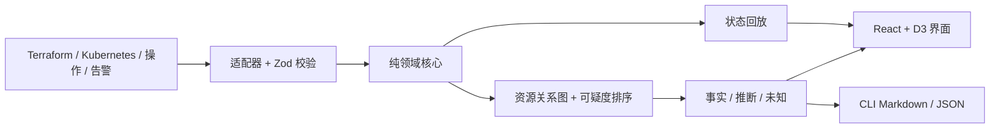

# Infra Rewind

[](https://github.com/KanadeK/infra-rewind/actions/workflows/ci.yml)
[](https://github.com/KanadeK/infra-rewind/actions/workflows/security.yml)
[](https://github.com/KanadeK/infra-rewind/actions/workflows/pages.yml)
[](https://github.com/KanadeK/infra-rewind/releases/latest)
[](LICENSE)

[English](README.md) · **当前状态：v0.1.0**

Infra Rewind 把 Terraform plan、Kubernetes diff、部署、告警与回滚放到同一条可审查时间线上，
并可回放任意证据时间点的资源状态。它会对同期变更进行可解释排序，但绝不把相关性冒充成确定根因。


- **倒带资源状态：**查看事故前、事故中和恢复后的期望状态。
- **推断可审计：**每个分数都展示时间、资源关系、变更风险和原始证据指针。
- **默认本地：**静态资源加载后，无需账号、遥测、上传接口或网络。

最快本地运行：

```bash
npm ci
npm run dev
```

也可以直接得到真实报告：

```bash
npm run analyze -- examples/config-misconfiguration --format markdown
```

已提交的输入记录了 `payments.internal` 被误改成 `payment.internal`、随后部署、5xx 告警和
回滚。真实输出把该 Kubernetes diff 排为 **96/100 的“推断”**，保留
`kubernetes-diff.json/changes/0` 证据指针，并把“确定根因”和缺失遥测继续列在“未知”中。

> 隐私边界：脱敏是纵深防御，不是保密保证。资源名、拓扑、ID 和自由文本仍可能敏感，分享前必须
> 人工检查输出。

## 功能

- 用 Zod 校验 Terraform plan JSON、Infra Rewind Kubernetes diff、操作事件与告警事件。
- 确定性规范化、稳定资源 ID、字段差异提取和敏感值脱敏。
- 依据时间接近度、已观察资源关系和变更风险构造关系图与有限置信度分数。
- 支持 create、update、replace、delete 与 rollback 的任意时间点状态回放。
- 报告严格区分观察事实、可解释推断与尚未解决的未知。
- React 响应式界面、D3 UTC 时间线、键盘控制、本地多文件导入、Web Worker 分析和真实
  Markdown/JSON 下载。
- 离线 CLI、本地适配器、确定性样例，以及显式调用的受限 HTTP 适配器。

## 非目标

Infra Rewind 不是 APM、日志库、部署控制器、事故协同平台或自动根因系统。它不会采集生产数据、
调用云 API、修改基础设施或证明因果。v0.1.0 也不承诺解析每家厂商的专有格式。

## 架构



`src/core/` 不依赖 UI 或网络。浏览器分析在模块 Worker 中运行，适配器只负责把外部格式转换成
核心事件。详见[架构文档](docs/ARCHITECTURE.md)和[输入格式](docs/INPUT_FORMATS.md)。

## 安装

要求 Node.js 22.13+、npm 10+。只有运行浏览器测试或重新截图时才需要 Playwright Chromium。

```bash
git clone https://github.com/KanadeK/infra-rewind.git
cd infra-rewind
npm ci
npm run dev
```

只含合成样例的在线演示位于
[kanadek.github.io/infra-rewind](https://kanadek.github.io/infra-rewind/)，不含用户数据或密钥。

## 快速开始

从三组已提交事故生成可供人工查看的真实报告：

```bash
npm run demo
```

打开 `demo-output/README.md`，或回放指定时间：

```bash
npm run analyze -- examples/config-misconfiguration \
  --format markdown \
  --at 2026-07-18T09:24:00.000Z \
  --out demo-output/config-after-rollback.md
```

回放得到的 `k8s:payments/deployment/api` 中
`PAYMENTS_BASE_URL=https://payments.internal`，与恢复 fixture 一致。

## 完整示例

每个 `scenario.json` 都声明证据文件、默认回放点、最高候选边界与精确状态断言：

```json
{
  "schema": "infra-rewind/scenario@1",
  "id": "unrelated-concurrent-change",
  "evidenceFiles": [
    "terraform-plan.json",
    "kubernetes-diff.json",
    "operations.json",
    "alerts.json"
  ],
  "defaultReplayAt": "2026-07-20T15:15:00.000Z",
  "expected": {
    "topCandidateId": null,
    "maxCandidateScore": 25,
    "replayChecks": [
      {
        "at": "2026-07-20T15:15:00.000Z",
        "resourceId": "k8s:storefront/deployment/web",
        "path": "spec.template.metadata.annotations.banner",
        "equals": "summer"
      }
    ]
  }
}
```

当前 `npm run demo` 对这组事故产生三个低分推断，最高 18/100；报告继续把它们标作推断，并保留
因果问题为未知，不会把“同期发生”改写成“确定根因”。

## CLI、源码 API 与界面

### CLI

```text
npm run analyze -- <scenario-directory> [options]

--format <json|markdown>  输出格式，默认 markdown
--out <path>              写入文件，不写则输出到 stdout
--at <ISO timestamp>      包含该时间点的资源重建状态
```

失败会返回非零退出码，并给出对应来源的校验或文件错误。

### 源码 API

v0.1.0 是应用而不是已发布的 npm 库。仓库内可以直接使用纯函数：

```ts
import { analyzeEvents, parseEvidenceDocument, replayStateAt } from "./src/core";

const events = parseEvidenceDocument(jsonText, { sourceName: "alerts.json" });
const analysis = analyzeEvents(events);
const state = replayStateAt(analysis.events, "2026-07-18T09:10:00.000Z");
```

`src/adapters/` 支持浏览器 `File`、安全的本地场景目录，以及显式 `http:`/`https:` URL；
所有入口经过相同的校验和脱敏流程。

### Web 界面

选择合成事故或导入多个受支持 JSON 文件。时间线标记和上一个/下一个按钮会更新回放点，资源面板
显示重建 JSON；可疑度卡展示分数组成，证据账本保留来源指针，导出按钮下载当前完整报告。

## 样例数据

所有 fixture 都是合成数据并采用 MIT 许可证，可离线运行。

| 场景         | 事件数 | 预期行为                          |
| ------------ | -----: | --------------------------------- |
| 配置错误     |      6 | 端点 diff 得分 96；回滚恢复端点   |
| 容量不足     |      6 | 副本缩减得分 95；恢复到三个副本   |
| 无关同期变更 |      4 | 所有候选仍是推断；最高分不超过 25 |

详见 [`examples/`](examples/)、[演示指南](docs/DEMO.md)与
[`examples/LICENSE.md`](examples/LICENSE.md)。

## 验证与性能

```bash
npm run lint
npm run typecheck
npm run test:coverage
npm run test:e2e
npm run build
npm run benchmark
npm run demo
npm run package
npm run verify
```

测试覆盖成功路径、损坏/缺失输入、路径越界、HTTP 失败、脱敏、评分边界、回放变化、Worker、
CLI、浏览器导入导出、响应式布局、键盘操作和 axe 无障碍规则。核心行覆盖率超过 98%。
实测机器、方法与结果见 [BENCHMARK.md](docs/BENCHMARK.md)。

仓库同时提供 `make verify`、`make demo`、`make package` 与 `make release-check`。系统没有
Make 时，使用同名 npm 脚本；它们都会执行真实检查。发布检查会强制要求干净工作区、带日期的
v0.1.0 CHANGELOG、已校验制品和一致的 Git 作者。

## 隐私与安全

静态应用没有分析脚本或上传路径。浏览器导入文件只保留在当前标签页内存，下载在本地生成。
CLI 只读取调用者显式指定的目录或 URL。系统会在规范化与导出时掩码凭证形态值和敏感字段，但
操作者仍必须先清洗输入、再检查输出。

参阅[隐私与安全](docs/PRIVACY_AND_SECURITY.md)和[安全策略](SECURITY.md)。漏洞请通过 GitHub
私密漏洞报告提交，不要创建公开 issue。

## 路线图

- **v0.1.x：**用公开且已清洗的 fixture 加固解析器和错误诊断，不扩大因果结论。
- **v0.2：**增加可选的签名 Git 历史及常见部署/告警导出适配器。
- **后续：**流式处理大型证据集、用户自定义关系规则、签名事故包。

任何扩展都必须有测试，并保持离线确定性。

## 贡献

请阅读 [CONTRIBUTING.md](CONTRIBUTING.md)，只使用合成或明确可再分发的 fixture，补充回归测试，
并运行完整验证命令。参与即表示同意[行为准则](CODE_OF_CONDUCT.md)。

## 相邻项目与差异

一次定点 GitHub 公开抽样检查了十个相邻仓库。最接近的工具通常只可视化 IaC 快照、协调事故、
聚合在线可观测性或生成复盘文档。Infra Rewind 收窄为：确定性离线多源证据、任意状态回放、
透明评分，以及严格的事实/推断/未知输出。抽样未发现同名且高度同构的活跃项目；这不是全网唯一
声明。详见[竞品扫描](docs/COMPETITOR_SCAN.md)。

## FAQ

### 96 分是不是等于已确定根因？

不是。它只表示已导入证据在时间、资源和变更风险上高度相关，报告仍将其标记为推断。

### 能否导入生产数据？

技术上可以，但必须先清洗并检查每份导出。v0.1.0 的默认与测试对象都是合成数据。

### Pages 演示会上传我选择的文件吗？

不会。部署的是静态应用，文件在浏览器本地分析。

### 为什么不让 LLM 直接给出根因？

当前范围优先保证确定性与可复现。未来可选解释层也不得改变事实或隐藏不确定性。

## 许可证

[MIT](LICENSE) © 2026 KanadeK。另见[第三方声明](THIRD_PARTY_NOTICES.md)。
