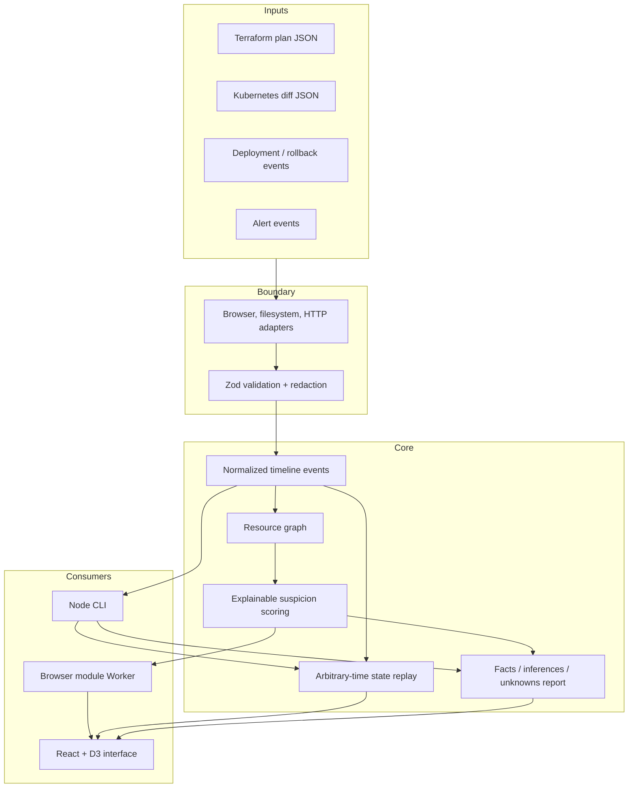

# Architecture

Infra Rewind separates deterministic domain logic from external adapters and rendering.

## Boundaries

- `src/core/` owns schemas, normalization, resource relationships, scoring, replay, and exports.
  It has no network, filesystem, browser, React, or D3 dependency.
- `src/adapters/` translates browser files, local scenario directories, and explicit HTTP responses
  into core inputs.
- `src/features/` owns UI use cases and accessible components.
- `src/workers/` runs parsing-independent analysis away from the browser's main thread.
- `examples/` contains synthetic, versioned evidence bundles with manifest expectations.

Adapters are one-way boundaries. Browser files use `lastModified` only when a source format lacks
its own timestamp. The HTTP adapter rejects non-HTTP protocols, checks response status, and uses
`Last-Modified` only as fallback evidence time. The Node adapter resolves every manifest entry and
rejects paths outside the manifest directory. All routes call the same schema validators and
defense-in-depth redaction path.

## Determinism and traceability

Normalization sorts events by ISO timestamp and stable ID. Terraform events receive a deterministic
FNV-1a-derived ID only when the optional fixture ID is absent. Resource nodes, edges, evidence
references, and changed paths are sorted before return. Scoring contains no random input and uses a
fixed default 360-minute window.

Every fact has one or more `EvidenceRef` values containing source name, JSON pointer, and observation
time. A suspicion hypothesis retains the candidate and alert references, three numeric dimensions,
plain-language rationale, and explicit limitations. Reports cannot promote a hypothesis into a
fact.

`generatedAt` is the only wall-clock value. Tests inject a fixed clock whenever that field matters;
replay and scoring depend only on evidence timestamps.

## Resource graph and scoring

Resources co-observed in one event become weighted graph edges. Affinity is classified as direct
resource overlap, observed graph connection, shared Kubernetes namespace, or no relationship.
Suspicion combines temporal proximity (35%), resource affinity (45%), and mutation risk (20%).
Namespace-only candidates are reduced; candidates with no resource relationship receive a stronger
penalty. These weights are visible behavior and covered by boundary tests.

This model ranks where an operator might inspect first. It is not a probabilistic causal model.

## Replay model

Each mutation carries `before`, `after`, action, changed paths, source, and timestamp. Replay applies
ordered mutations through the requested instant:

- create/update/replace establish the `after` state;
- delete removes the resource;
- a later recovery or rollback mutation establishes its own `after` state.

Snapshots expose the resource ID, state, last event ID, and change time. Fixture manifests assert
exact dotted paths before, during, and after each incident.

## Browser execution

The browser sends normalized events to a module Worker. The Worker builds the graph and scores
hypotheses, then returns an immutable analysis result. React owns only selected scenario, replay
time, and presentation state. D3 supplies UTC scales and tick placement; React renders accessible
SVG groups and controls. Markdown/JSON downloads use browser `Blob` URLs generated from the current
analysis—there are no simulated export buttons.

## Failure model

Parsers distinguish invalid JSON, invalid schema, and unsupported formats. Adapters add source and
transport context. The interface keeps the last valid analysis visible when a subsequent import
fails. The CLI prints the actionable error to stderr and exits non-zero. Neither surface silently
converts invalid evidence into an empty successful report.
